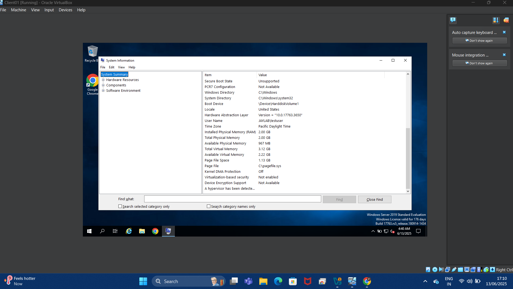
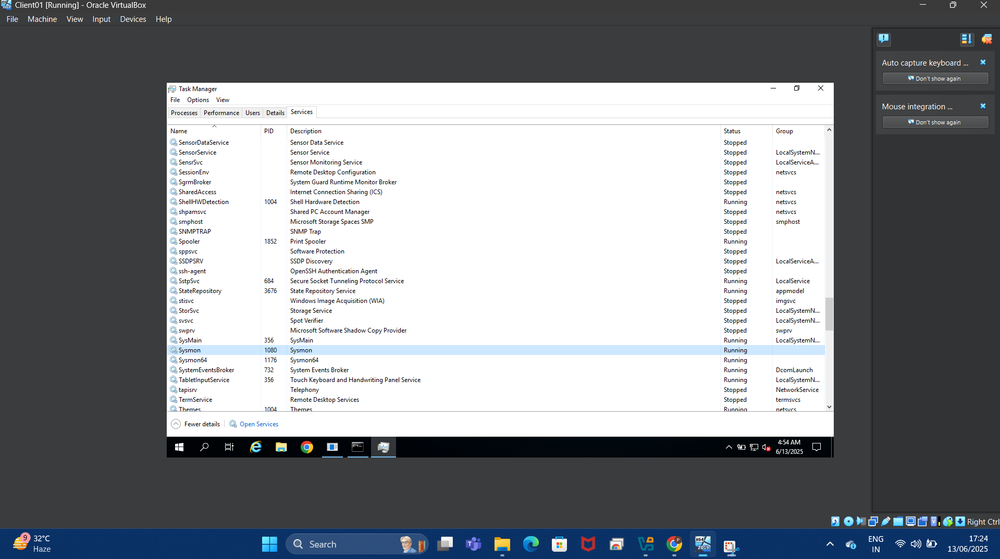
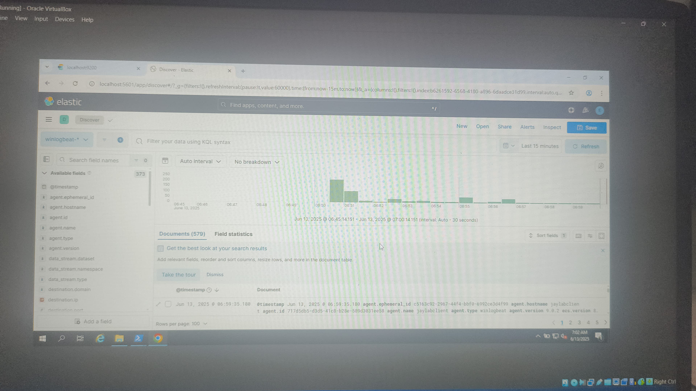

 🛡️ Active Directory Monitoring Lab 

This project demonstrates how to set up and monitor an *Active Directory environment* using open-source tools like *Sysmon, **Winlogbeat, **Elasticsearch, and **Kibana. It simulates a real-world **SOC (Security Operations Center)* setup, where logs are collected, forwarded, and visualized for threat detection and monitoring.

---

 📁 Lab Overview

- *Domain Name*: JayLab.local
- *Domain Controller VM*: Hosts Active Directory, Elasticsearch, and Kibana
- *Client VM*: Domain-joined Windows 10 with Sysmon + Winlogbeat
- *Monitoring Stack*: Sysmon ➜ Winlogbeat ➜ Elasticsearch ➜ Kibana

---

🛠️ Environment Setup

 1. Domain Controller (JayLab.local)
- Windows Server with Active Directory roles
- Elasticsearch installed and running
- Kibana installed and accessible for visualizing logs

 2. Client Machine (TestUser)
- Windows 10 VM joined to the domain
- Sysmon installed for endpoint activity logging
- Winlogbeat configured to forward logs to the ELK stack

---
 📸 Key Screenshots

 🔹 1. Domain Join Success

 🔹 2. Sysmon Installation Complete

 🔹 3. Winlogbeat Config and Service Running

 🔹 4. Kibana Dashboard Showing Logs

> ℹ️ More screenshots are available in the /Screenshots/ folder.

---

 🔧 Tools & Configuration

| Tool             | Purpose                                                                 |
|------------------|-------------------------------------------------------------------------|
| Active Directory | Centralized identity and domain management                              |
| Sysmon           | Captures detailed system events (processes, registry, network, etc.)    |
| Winlogbeat       | Forwards event logs and Sysmon logs to Elasticsearch                    |
| Elasticsearch    | Indexes and stores logs                                                  |
| Kibana           | Visualizes log data through dashboards and queries                      |

---

 🔄 Data Flow Diagram

Sysmon (Client) 
      ↓
 Winlogbeat (Client)
      ↓ 
Elasticsearch (Domain Controller) 
      ↓ 
Kibana (Domain Controller)

---

 🔐 Security Hardening

Implemented via Group Policy and manual configuration:

- Disabled guest accounts  
- Enforced password policies  
- Configured RDP & Windows Firewall  
- Applied basic GPO hardening (see SecurityHardening.md)  

---

 📁 Project Structure

| File / Folder              | Description                               |
|---------------------------|-------------------------------------------|
| README.md               | Project documentation                     |
| Installation_Steps.md   | Detailed setup instructions                |
| NetworkDiagram.md       | Logical layout of the lab (update pending) |
| SecurityHardening.md    | Security configurations and GPO details    |
| scripts/                | PowerShell scripts for GPO & configuration |
| screenshots/            | Project screenshots for documentation      |

---

 📌 Notes

- This lab does *not use Splunk, Linux, or Red Team tools*.
- Focus is on *blue team monitoring* in a clean AD environment using the Elastic Stack.
- Ideal for *SOC analyst beginners, students, or home lab builders*.

---

 📈 Future Improvements

- Simulate attacks using *Kali Linux* or *Atomic Red Team*
- Integrate *Sigma rules* for threat detection
- Use *Logstash* for advanced log parsing

---

## 📌 Notes

- This project does **not** use Splunk, Linux, or red team tools like Kali.
- The focus is on **setting up and monitoring a clean AD environment** using Elastic Stack tools.
- Ideal for beginner SOC analysts or cybersecurity students.

---

## 📈 Future Improvements 

- Add simulated attacks using Kali Linux or Atomic Red Team
- Integrate Sigma rules for detection use cases
- Use Logstash for custom parsing pipelines

---

## 📚 Credits

- [Elastic Stack](https://www.elastic.co/)
- [SwiftOnSecurity Sysmon Config](https://github.com/SwiftOnSecurity/sysmon-config)
- [Winlogbeat Documentation](https://www.elastic.co/guide/en/beats/winlogbeat/current/index.html)